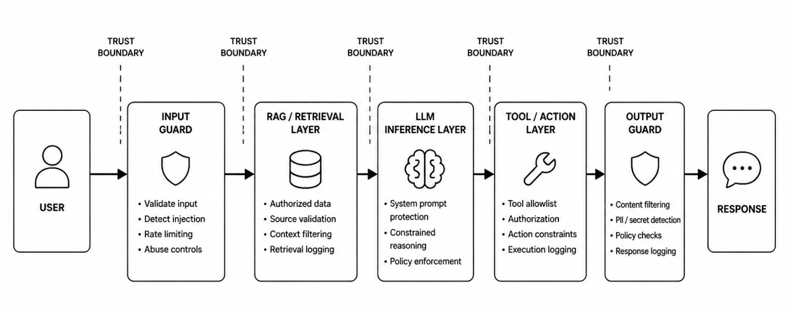

# Secure Inference Architecture Blueprint


**Secure the behavior, not just the model.**

A practical security architecture blueprint for designing AI inference systems that hold under adversarial input, unsafe retrieval, tool abuse, and output leakage.

This project treats AI inference as a **system**, not just a model call.

---

## Why this exists

Most AI security discussions focus on the model.

In real-world systems, failures rarely happen *inside* the model.
They happen across the system:

* Input handling
* Retrieval pipelines (RAG)
* Tool execution
* Output generation
* System integration

This project focuses on securing the **entire inference pipeline** — where real risk exists.

---

## Core Idea

AI security is not a model problem.
It is an **inference architecture problem**.

A secure inference pipeline must control:

* User input
* Retrieval and context assembly
* LLM reasoning behavior
* Tool and action execution
* Output filtering
* Logging, monitoring, and policy enforcement

---

## Secure AI Inference Pipeline

```text
User
  ↓
Input Guard
  ↓
Retrieval Layer / RAG
  ↓
LLM Inference Layer
  ↓
Tool / Action Layer
  ↓
Output Guard
  ↓
Response
```

Each stage is a **trust boundary**.

Each boundary must enforce validation, authorization, and policy controls before data or actions move forward.



---

## Design Principles

* **Zero Trust** — no implicit trust between components
* **Least Privilege** — restrict data and actions at every stage
* **Explicit Control Points** — enforce controls at each boundary
* **Constrained Execution** — the model suggests, the system decides
* **Defense in Depth** — layered controls across the pipeline

---

## What this repo provides

* Architecture blueprint for secure inference pipelines
* Threat modeling approach (STRIDE adapted for AI systems)
* Attack path mapping across inference layers
* Layer-specific security controls (input → output)
* Practical checklists for architecture reviews
* Reusable templates for product security teams

---

## Threat Modeling Foundations

This blueprint aligns with:

* OWASP Top 10 for LLM Applications (2025)
* NIST AI Risk Management Framework (GenAI Profile)
* MITRE ATLAS (Adversarial Threat Landscape for AI Systems)

---

## Example Use Case

A customer support RAG assistant:

* Retrieves internal documents
* Uses LLM to generate responses
* Executes actions (refunds, updates)

This repo demonstrates how to:

* Prevent prompt injection at input boundaries
* Secure retrieval pipelines against data poisoning
* Enforce authorization and validation on tool execution
* Prevent sensitive data leakage in outputs

---

## How to use

1. Start with the architecture blueprint
2. Identify trust boundaries
3. Map attack paths across the pipeline
4. Apply controls at each boundary
5. Use checklists during architecture reviews

---

## Repository Structure

```text
architecture/   → System design & trust boundaries  
threat-model/   → Threat modeling & attack paths  
controls/       → Security controls per layer  
checklists/     → Review checklists  
templates/      → Reusable security templates  
examples/       → Real-world system example  
```

---

## About the Author

Khirawdhi Ray

---

## License
MIT
